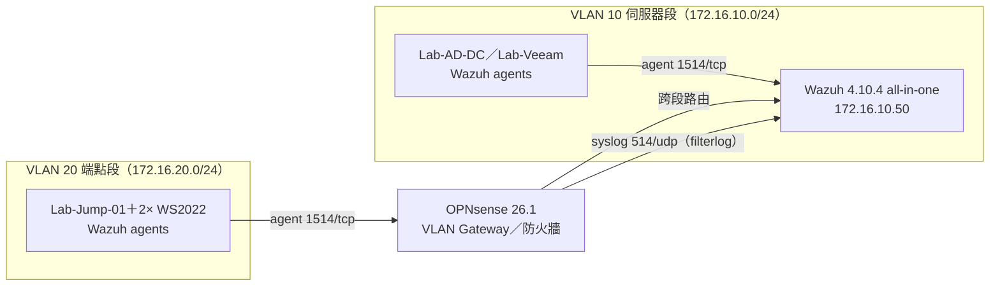

# SIEM Home Lab — Wazuh on Proxmox VE

> A miniature enterprise SOC on a single Proxmox host: Wazuh SIEM, OPNsense VLAN segmentation, and real ops workloads (AD / Veeam / WSUS) as log sources.

單台 Proxmox VE 主機上的企業縮影 SOC 實驗室：OPNsense 做網段切分與跨段管制，Wazuh 集中收容 Windows 端點與防火牆日誌，AD／Veeam／WSUS 等企業標配元件產生真實維運日誌。定位：**SI 維運背景 × 資安偵測工程**的實作紀錄，與 CompTIA CySA+ 相互印證。

## 環境一覽

| 層 | 內容 |
|---|---|
| 硬體 | Intel Xeon E5-2697A v4（16C/32T）／64GB RAM／NVMe 1TB＋HDD 1TB |
| 虛擬化 | Proxmox VE（pve-manager 9.2.3），單機 11 台 VM/LXC |
| 網路 | OPNsense 26.1：WAN 實體 NIC 直通；VLAN 10 伺服器段（172.16.10.0/24）／VLAN 20 端點段（172.16.20.0/24）／untagged 管理段（172.16.1.0/24），跨段流量強制經防火牆 |
| SIEM | Wazuh v4.10.4 all-in-one（manager＋indexer＋dashboard 同機） |
| Log 源 | 5× Windows agent（AD DC、Veeam、跳板機、2× WS2022）＋ OPNsense 防火牆 syslog（filterlog） |
| 攻擊面 | Kali 2026.1＋Atomic Red Team（M4 階段啟用） |

## 資料流

完整拓撲、元件表與設計要點：[docs/architecture.md](docs/architecture.md)

## 建置歷程

按日記錄於 [docs/build-log.md](docs/build-log.md)。精選：

- **2026-07-07（Day 1）**：實機盤點時發現 5 台 agent 全數 Disconnected → 根因分析（manager IP 遷移後 agent 設定未跟上）→ 批次修復，當日 5/5 復線。完整排查手冊見 [docs/troubleshoot-agent-disconnect.md](docs/troubleshoot-agent-disconnect.md)。
- **同日**接入第二種 log 源：OPNsense syslog → Wazuh（[docs/m2-opnsense-syslog.md](docs/m2-opnsense-syslog.md)）。踩坑：內建規則 87701 對單筆防火牆 drop 設 `no_log`，alerts 頁看不到，驗證必須看 archives——這個盲區就是自訂規則（M3）的第一個題目。

## 里程碑

| # | 里程碑 | 驗收標準 | 狀態 |
|---|---|---|---|
| M1 | 架構定稿 | 拓撲圖＋元件表＋資料流＋設計要點 | 🟡 v1.0 草稿完成 |
| M2 | SIEM 上線 | ≥2 種 log 源＋儀表板證據 | 🟡 兩源已達成，證據補檔中 |
| M3 | 偵測工程 | ≥5 條自訂規則，各對應 MITRE ATT&CK＋觸發證據 | ⬜ |
| M4 | 攻擊模擬 | ≥2 個完整情境（ART／Kali）→ IR 報告 | ⬜ |
| M5 | 履歷化 | README／resume 整理 | 🟡 repo 骨架完成 |

## 文件地圖

| 路徑 | 內容 |
|---|---|
| [docs/architecture.md](docs/architecture.md) | 架構文件（M1）：拓撲、元件、資料流、設計要點 |
| [docs/build-log.md](docs/build-log.md) | 建置歷程（按日） |
| [docs/troubleshoot-agent-disconnect.md](docs/troubleshoot-agent-disconnect.md) | Agent 斷線排查手冊（官方文件逐條查證） |
| [docs/m2-opnsense-syslog.md](docs/m2-opnsense-syslog.md) | OPNsense syslog 接入步驟（官方文件查證版） |
| [docs/detections/](docs/detections/) | 自訂偵測規則（M3） |
| [docs/incidents/](docs/incidents/) | 攻擊模擬與 IR 報告（M4） |
| [docs/evidence/](docs/evidence/) | 可展示證據索引與截圖 |

## 資安聲明

本 repo 所有內網 IP 均已**範例化**（172.16.x 為文件示意值，非實際環境；對外連線僅以「雙層 NAT」描述）。完整設定檔（防火牆 config、SIEM 主設定等）一律不進 repo，文件僅引用去敏片段；金鑰、密碼、agent key 以 `<PLACEHOLDER>` 表示。截圖入庫前經遮蔽檢查與 IP 打碼（見 docs/evidence/INDEX.md 註記）。
