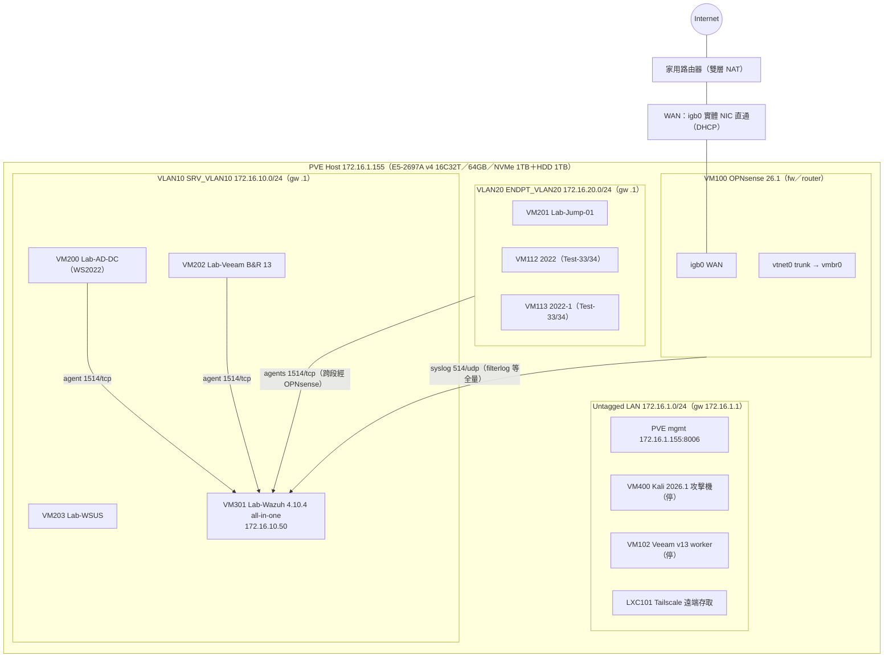

# architecture.md — SIEM Home Lab 架構（M1）

v1.0 草稿：2026-07-07（設計要點措辭待 Luke 定稿後轉正式版）
事實來源：private\ 三份原始設定（opnsense-config／ossec.conf／pve-vm-configs，2026-07-07）＋實機盤點。
IP 聲明：文中內網 IP 已範例化（非實際環境值）；對照表存內部管理檔，不隨 repo 公開。

## 總覽

單台 Proxmox VE 主機上的虛擬化 SOC 實驗環境：OPNsense 做 VLAN 網段切分與跨段管制，Wazuh（all-in-one）集中收容 Windows 端點與防火牆日誌，Kali＋Atomic Red Team 提供攻擊模擬面。企業常見元件（AD、WSUS、Veeam）產生真實維運日誌，呼應 SI 實務背景。

## 拓撲圖

## 元件與角色

| 元件 | VMID | 網段 | 資源 | 角色／log 貢獻 |
|---|---|---|---|---|
| OPNsense 26.1 | 100 | WAN＋trunk | 2C/4G | 防火牆、VLAN gateway、**syslog log 源**（514/udp → Wazuh） |
| Wazuh 4.10.4 all-in-one | 301 | VLAN10（172.16.10.50） | 12C/12G/100G | SIEM：manager＋indexer＋dashboard 同機 |
| Lab-AD-DC（WS2022） | 200 | VLAN10 | 2C/6G | AD 網域控制站，**Windows 事件 log 源**（agent 001） |
| Lab-Veeam B&R 13.0.2 | 202 | VLAN10 | 6C/16G/240G×2 | 備份伺服器（agent 006）；第二顆碟在 HDD cold_data |
| Lab-WSUS | 203 | VLAN10 | 4C/6G | 更新管理（未裝 agent） |
| Lab-Jump-01 | 201 | VLAN20 | 4C/6G | 跳板機（agent 002） |
| 2022／2022-1 | 112/113 | VLAN20 | 各 4C/6G | WS2022 測試端點（agent 005/004＝Test-33/34） |
| Kali 2026.1 | 400 | untagged LAN | 6C/8G | 攻擊機（M4 用，平時關機） |
| Veeam worker | 102 | untagged LAN | 6C/6G | Veeam v13 Linux worker（平時關機） |
| Tailscale | LXC101 | untagged LAN（DHCP） | 1C/0.5G | 遠端管理通道 |

## 資料流（SIEM 相關）

| 流向 | Port/Proto | 用途 | 狀態 |
|---|---|---|---|
| agents（VLAN10/20）→ 172.16.10.50 | 1514/tcp | agent 事件＋keep-alive；VLAN20 端點跨段經 OPNsense 路由 | ✅ 5/5 Active |
| agents → 172.16.10.50 | 1515/tcp | enrollment（註冊） | 已註冊 |
| OPNsense（172.16.10.1）→ 172.16.10.50 | 514/udp | 全量 syslog（filterlog、configd 等）；ossec.conf 新增 syslog `<remote>`（allowed-ips 172.16.10.1） | ✅ 2026-07-07 實機驗證接通（archives 出現 filterlog）。註：private\ ossec.conf 快照為**改前**版本，改後版待重收 |
| Wazuh 內部 | 9200（127.0.0.1）、443 | indexer／dashboard | all-in-one 本機 |

## 設計要點（草稿，最終措辭由 Luke 定）

1. **分段即觀測**：伺服器（VLAN10）與端點（VLAN20）分段，跨段流量強制經 OPNsense——防火牆成為天然觀測點，filterlog 直接變成 SIEM log 源。
2. **all-in-one SIEM**：單機資源（64GB 已高負載）下選 Wazuh 單節點；代價是無 HA，屬 lab 合理取捨。
3. **WAN 實體 NIC 直通**：WAN 流量不經 vmbr0，縮小 hypervisor bridge 暴露面。
4. **SI 背景×資安**：AD／WSUS／Veeam 是企業標配，其日誌讓偵測規則有真實素材，也支撐「維運轉資安」敘事。

## 已知課題／後續

- 雙層 NAT（上游家用路由器）：對外攻擊面模擬受限，M4 情境以內網橫向為主。
- Untagged LAN（172.16.1.0/24）為歷史網段：manager 已由 172.16.1.50 遷至 172.16.10.50（2026-07-07 事件，見 STATUS）；Kali／Tailscale／PVE mgmt 仍在此段，是否遷移待定。
- Kali 在 untagged 段：攻擊模擬要打 VLAN10/20 需跨段，OPNsense 規則屆時同步設計（正好產生攻防兩側證據）。
- WSUS 未裝 agent：補裝可加一台 log 源（低成本加分項）。
- Wazuh 4.10.4 → 4.14 升級：候選維運素材（待裁決）。

## 證據

見 docs\evidence\INDEX.md（#1 agents 5/5 Active；#2 OPNsense filterlog 流入）。
