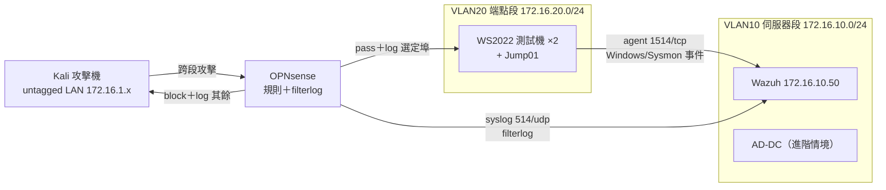

# Roadmap — 攻防驗證 campaign（M3 偵測工程 + M4 攻擊模擬）

一條完整的「防火牆規則 → log 擷取 → 攻擊 → 判讀」閉環。文中 IP 為範例值（172.16.x）；真實對照見內部 `private/lab-execution-cheatsheet.md`（不在 repo）。

## 為什麼是這個順序

先鋪觀測面、再攻擊、最後判讀並把缺口變成規則——沒有 log 源就攻擊，等於打了沒證據。四個階段對應四份指南：

| 階段 | 指南 | 目的 | 產出 |
|---|---|---|---|
| 收尾 | （見 STATUS/M2） | 補 M2 證據 #2、關 `<logall>` 前先確認 | M2 完成 |
| Phase 1 | [phase1-opnsense-firewall.md](phase1-opnsense-firewall.md) | 防火牆規則：讓攻擊「打得到端點、掃描被擋下」，兩側都留 log | 規則＋別名＋logging |
| Phase 2 | [phase2-wazuh-log-capture.md](phase2-wazuh-log-capture.md) | 把端點與防火牆的 log 完整接進 Wazuh（Sysmon、稽核原則、eventchannel、archives） | 驗證過的 log 源清單 |
| Phase 3 | [phase3-kali-attack-sim.md](phase3-kali-attack-sim.md) | Kali＋ART 發起分層攻擊（偵察→暴力破解→技術執行） | 攻擊執行紀錄＋時間戳 |
| Phase 4 | [phase4-verify-interpret.md](phase4-verify-interpret.md) | 回頭驗證 Wazuh 收到什麼、判讀、對應 MITRE、找缺口 | 每情境一份 IR 報告 |

M3（≥5 條自訂規則）與 M4（≥2 個情境）在跑完 Phase 3/4 後自然成形——規則來自 Phase 4 找到的偵測缺口，情境報告來自 Phase 3/4 的攻防紀錄。

## 攻擊拓撲（本 campaign）

## MITRE ATT&CK 覆蓋目標

| 戰術 | 技術 | 來源 | 對應 Phase |
|---|---|---|---|
| Reconnaissance / Discovery | T1595 Active Scanning、T1046 Network Service Discovery、T1018 Remote System Discovery | Kali nmap | 3→4 |
| Credential Access | T1110 Brute Force（RDP/SMB） | Kali hydra/netexec | 3→4 |
| Execution | T1059.001 PowerShell | ART on endpoint | 3→4 |
| Persistence | T1136.001 Create Account、T1053.005 Scheduled Task | ART on endpoint | 3→4 |
| （進階選配） | T1003 Credential Dumping、完整 exploit 鏈 | ART / Metasploit | M4 進階 |

## 里程碑驗收

- **M3 完成**：≥5 條自訂規則，各有規則 XML、MITRE 對應、`wazuh-logtest` 驗證輸出、觸發截圖 → `docs/detections/`。規則計畫見 [detections/README.md](detections/README.md)。
- **M4 完成**：≥2 個完整情境（ART 至少 1、Kali 手動鏈至少 1），各一份 IR 報告 → `docs/incidents/`。格式見 [incidents/README.md](incidents/README.md)。

## 每階段收尾（固定動作）

1. 截圖存證（打碼後）→ `docs/evidence/` 並登記 `INDEX.md`。
2. 更新 `STATUS.md` 當日進度與下一步。
3. `docs/build-log.md` 加一節。
4. commit＋push（照 `GIT-WORKFLOW.md`；先跑真實 IP 檢查）。

## 給接手模型

執行本 campaign 前，先讀內部必讀清單（見 `PROJECT.md` 開頭）與 `AI-HANDOFF.md`。每個 Phase 指南都能獨立執行；遇到需 Luke 決定的點，先查 `DECISIONS-2026-07-07-campaign.md` 是否已定案，沒有再問。
